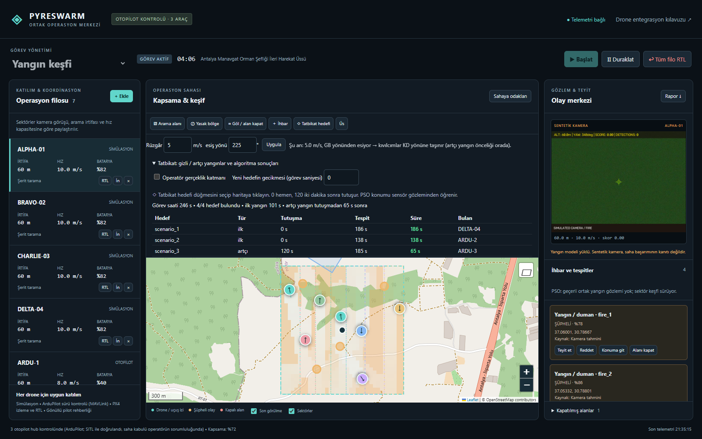
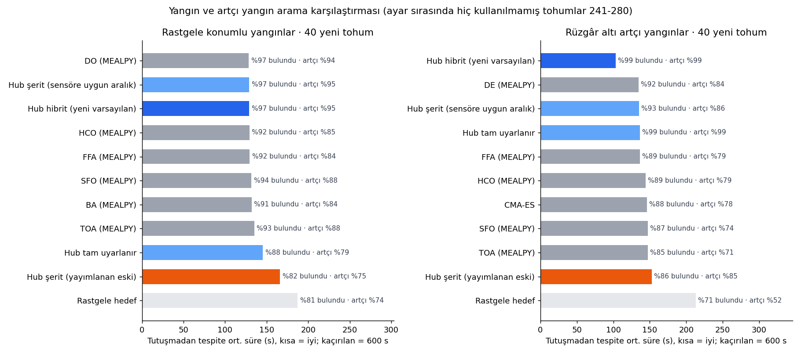
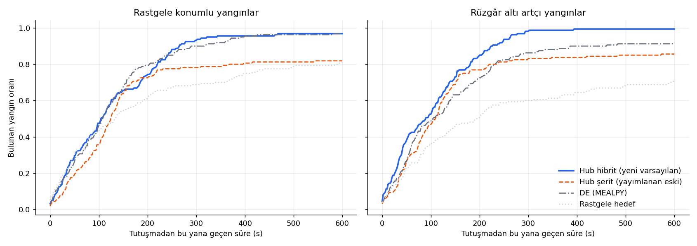
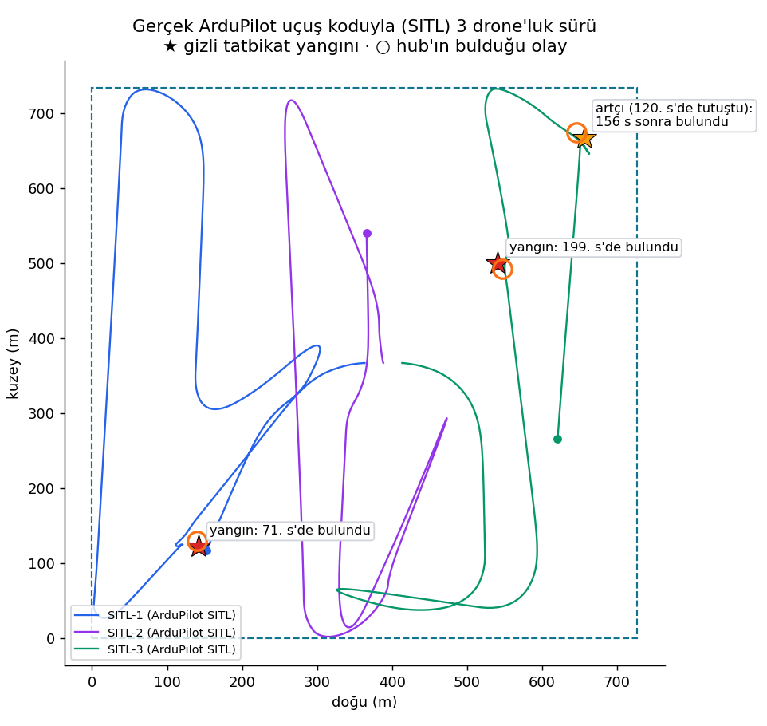
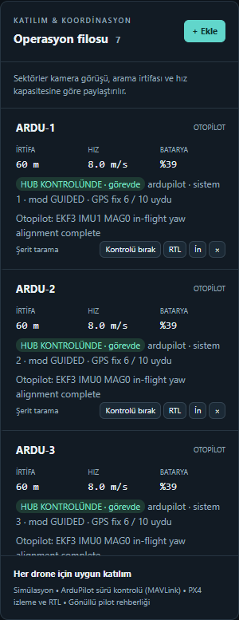

# PyreSwarm — drone sürüsüyle yangın ve artçı yangın arama merkezi

PyreSwarm, farklı marka ve kapasitedeki drone'ları tek bir sürüde toplayan bir yer istasyonudur. Operatör arama alanını ve rüzgârı girer, drone'unu bağlar, **Başlat** der; sürü alanı kamera erişimine göre paylaşır, kamera görüntüsündeki yangını bulur ve rüzgârın kıvılcım taşıdığı yöne, artçı yangınların çıkacağı yere döner.



| Katılım | Hub ne yapar |
|---|---|
| **ArduPilot Copter** (MAVLink: telemetri radyosu, ağ, SITL) | Önce izler. Uçuş öncesi kontroller geçip operatör **Hub kontrolüne al** deyince GUIDED modunda kaldırır ve sürüyle uçurur. |
| **PX4** (MAVLink) | İzler, haritada gösterir, RTL / iniş komutu verir. |
| **Başka marka / SDK köprüsü** | Gerçek telemetri ve kamera karesini alır, pilota yön-hız-irtifa önerir. Drone'u pilot uçurur. |
| **Simülasyon** | Aynı planlayıcıyla uçan eğitim ve tatbikat drone'ları. |

## Sonuçlar

### Yangını ve artçıları ne kadar hızlı buluyor?

Aynı 4 drone, 800 × 800 m alan, 10 dakika, 40 m menzilli ve %20 kaçıran bir test sensörü. Her senaryoda 2 yangın başta, 2 artçı yangın 3. ve 6. dakikada tutuşur. Yangınların yeri hiçbir yönteme verilmez. Yöntem ayarları 101–120 tohumlarında yapıldı; aşağıdaki sayılar ayar sırasında **hiç kullanılmamış 241–280 tohumlarıdır** (her senaryoda 40 × 21 yöntem = 840 koşu). Kaçırılan yangın 600 s gecikme sayılır, ortalamadan atılmaz.

**Rüzgâr altı artçı yangınlar** (5 m/s rüzgâr, artçılar ilk yangının 150–450 m rüzgâr altında):

| Yöntem | İlk yangın (s) | Bulunan | Artçı bulunan | Artçı tespit süresi (s) | Artçıların yarısı (medyan, s) | 1 dk içinde bulunan artçı |
|---|---:|---:|---:|---:|---:|---:|
| **PyreSwarm hibrit (varsayılan)** | 70.7 | **%99.4** | **%98.8** | **75.5** | **54** | **%54** |
| Şerit tarama (sensöre uygun aralık) | 70.7 | %93.1 | %86.2 | 133.6 | 125 | %36 |
| En iyi kütüphane yöntemi (DE, MEALPY) | 68.9 | %91.9 | %83.8 | 139.1 | 128 | %34 |
| Önceki yayımlanan sürüm | 73.3 | %85.6 | %85.0 | 120.4 | 94 | %30 |
| Rastgele hedef | 118.3 | %70.6 | %52.5 | 196.3 | 226 | %25 |

**Rastgele konumlu yangınlar** (rüzgâr yok): hibrit, şerit taramayla aynıdır ve en iyi kütüphane yöntemiyle berabere kalır: %96.9 bulunan, artçıların %95.0'i, ortalama gecikme 128.9 s (DO: %96.9, %93.8, 128.5 s). Önceki sürüm %81.9 bulmuştu.





Ne işe yarıyor: rüzgâr yokken şeritleri tekrar etmek en hızlı yoldur; hibrit de öyle yapar. Bir yangın bulunduğunda sektörünü bir kez taramış drone'lar rüzgâr altındaki kıvılcım konisine döner; artçı yangın orada çıktığında zaten yakındadırlar. 21 yöntemin tam tabloları, tüm koşular ve yöntem: [docs/SWARM_COMPARISON_TR.md](docs/SWARM_COMPARISON_TR.md), `artifacts/search_v2/final_*`.

### Gerçek ArduPilot uçuş koduyla (SITL) üç drone'luk sürü

ArduCopter 4.5.7 SITL: uçuş kodu gerçek, araç ve GPS simüle. Hub her aracı ayrı MAVLink bağlantısıyla sürdü; tatbikat kamerası gizli yangınları karede gerçek yerinde çizdi, yangın modeli (`best.pt`) gerçekten çalıştı.

| Adım | Sonuç |
|---|---|
| Bağlantı | 3/3 araç, sistem kimliği 1-3 |
| GPS/EKF hazır olmadan kontrol isteği | **Reddedildi** (GPS, EKF, ev konumu); o ana kadar hiçbir hareket komutu gönderilmedi |
| Uçuş öncesi kontrollerin geçmesi | 42 s (GPS fix, EKF, ev konumu) |
| Kalkış (GUIDED + kollama + kalkış) | 60 m arama irtifası ~30 s |
| 1. yangın | 70.8 s'de bulundu, konum hatası 7.8 m |
| 2. yangın | 199.3 s'de bulundu, konum hatası 10.3 m |
| Artçı yangın (120. s'de tutuşur, rüzgâr altında) | tutuşmadan 156.4 s sonra bulundu, konum hatası 12.7 m |
| Drone'lar arası en az yatay mesafe | arama ve incelemede 72.9 m (kalkışta, 25 m aralı kalkış noktalarından: 24.8 m) |
| Pilot kumandadan mod değiştirdi (LOITER) | Hub aracı **0.1 s** içinde bıraktı, komut göndermeyi kesti |
| Hub bağlantısı koptu | Otopilot **4.4 s** sonra kendi başına **RTL** yaptı |
| Kalan araçlara RTL | 96 s içinde indiler |



Aynı akış arayüzden de denendi: 4 simülasyon drone'u ve **+ Ekle → MAVLink otopilot** ile eklenen 3 ArduPilot SITL drone'u tek filoda, 5 m/s rüzgâr, 4 gizli yangın. Kontroller yeşile dönünce üç otopilot hub kontrolüne alındı; ilk yangın 101 s'de, rüzgâr altındaki artçı yangın **tutuşmadan 65 s sonra** bir ArduPilot drone'u tarafından bulundu, dört yangının dördü de bulundu. *Tüm filo RTL* sonrası yedi drone 110 s içinde indi.



Kendi bilgisayarınızda: `SITL_BASLAT.bat` (Docker gerekir), sonra `py -3.11 tools/sitl/sitl_swarm_trial.py`. Sonuç: `artifacts/sitl_trial/result.json`.

## Başlatma

Windows'ta `BASLAT.bat` ya da:

```powershell
py -3.11 -m pip install -r requirements.txt
py -3.11 run.py
```

Arayüz: http://127.0.0.1:8000 (yalnızca bu bilgisayarda dinler).

## Drone'unu getir, sürüye kat

1. **+ Ekle → MAVLink otopilot.** Bağlantı: `COM3,57600` (telemetri radyosu), `udpin:0.0.0.0:14550` (ağ / Wi-Fi / yer istasyonu yönlendirmesi) ya da `tcp:127.0.0.1:5760` (SITL). Aynı bağlantıda birden çok araç varsa sistem kimliğini (`SYSID_THISMAV`) yazın.
2. Kart **GÖZLEM** rozetiyle gelir; hub hareket komutu göndermez. Uçuş öncesi kontroller kartta tek tek yeşile döner: bağlantı, otopilot, GPS 3D fix + 6 uydu, EKF, ev konumu, batarya %40, bağlantı kaybında RTL (`FS_GCS_ENABLE`), üsse en fazla 5 km.
3. **Hub kontrolüne al.** Görev çalışıyorsa drone kalkar ve sürüye katılır; çalışmıyorsa **▶ Başlat** ile birlikte kalkar.

Adım adım saha kullanımı, önerilen otopilot ayarları ve acil durum tablosu: **[docs/SAHA_KILAVUZU_TR.md](docs/SAHA_KILAVUZU_TR.md)**. Marka bazında bağlantı yolları: [docs/DRONE_INTEGRATION_TR.md](docs/DRONE_INTEGRATION_TR.md).

## Güvenlik modeli

| Durum | Davranış |
|---|---|
| Kontroller geçmeden | Kontrol isteği reddedilir, eksik kontrol adıyla gösterilir |
| Her komut | Otopilottan ACK beklenir; mod değişimi heartbeat ile doğrulanır |
| Pilot modu değiştirir | Hub o aracı anında bırakır (**PİLOT DEVRALDI**), tekrar katmak operatör kararıdır |
| Hub bilgisayarı / bağlantı gider | Hub komutu keser; otopilot kendi GCS failsafe'iyle eve döner |
| İki drone aynı olayı inceler | Olayın karşı yanlarında (~44 m ara) ve farklı irtifada (35 / 45 m) durur |
| Yasak bölge / göl | Rotalar etrafından planlanır, içinden geçilmez |
| Olay teyidi | Hub hiçbir olayı kendi teyit etmez; operatör teyit eder ya da reddeder |

## Tatbikat

**◇ Tatbikat hedefi** ile haritaya gizli yangın koyun, isterseniz gecikmeli (artçı) tutuşsun. Planlayıcı hedefin yerini hiç görmez; yalnızca kamera görürse olay oluşur. Tatbikat tablosu her hedef için tutuşma anını, tespit anını ve **tespit süresini** gösterir. Gerçek otopilotlarla tatbikat: drone'u eklerken **Tatbikat sentetik kamerası** kutusunu işaretleyin.

## Doğrulama

```powershell
py -3.11 -m pytest tests -q                         # 118 test
node --check web/static/js/dashboard.js
py -3.11 scripts/compare_swarm_search.py --families all --scenario spotting --seeds 241 242 243
py -3.11 scripts/make_search_report.py               # tablolar ve grafikler
```

## Sınırlar

- Sayılar simülasyon ve SITL sonuçlarıdır. **Gerçek araçla saha kabulü yapılmadı.** İlk gerçek uçuşlar açık alanda, tek araçla ve kumandası elinde bir pilotla yapılmalıdır; uçuş izni ve bölge kuralları operatörün sorumluluğundadır.
- Karşılaştırmadaki sensör geometrik bir test sensörüdür (40 m, %20 kaçırma, yanlış alarm yok); YOLO'nun sahadaki doğruluğu ölçülmedi. SITL'deki kamera tatbikat kamerasıdır: yangın fotoğrafını karede yerine koyar, gerçek görüntü değildir.
- Konum tahmini aşağı bakan (nadir) kamera ve düz arazi varsayar. `relative_alt` kalkış noktasına göre irtifadır; engebeli arazide AGL değildir.
- PX4 bu sürümde sürü kontrolüne alınmaz (izleme + RTL/iniş). DJI ve kapalı sistemler üretici SDK'sıyla yazılmış bir köprü ister.
- Arama-kurtarma modunda gerçek insan algılama modeli bağlı değildir (sentetik sensör + operatör ihbarı).
- Hub merkezîdir: drone'lar arası doğrudan ağ yoktur. Sunucuyu internete açmak için kimlik doğrulama ve TLS gerekir.

## Belgeler

| Konu | Belge |
|---|---|
| Sahada adım adım kullanım | [Saha kılavuzu](docs/SAHA_KILAVUZU_TR.md) |
| Harita, olaylar, gönüllü katılımı | [Hub kullanımı](docs/HUB_GUIDE_TR.md) |
| Marka bazında bağlantı, gönüllü köprüsü | [Drone entegrasyonu](docs/DRONE_INTEGRATION_TR.md) · [MAVLink kurulumu](docs/MAVLINK_SETUP_GUIDE.md) |
| Uçuş güvenliği davranışları | [SAFETY](docs/SAFETY.md) |
| Kurulum, SITL, sorun giderme | [Kurulum](docs/DEPLOYMENT.md) · [Sorun giderme](docs/TROUBLESHOOTING.md) |
| API ve ayarlar | [API](docs/API.md) · [Yapılandırma](docs/CONFIGURATION.md) · [Yazılım güvenliği](docs/SECURITY.md) |
| Yangın modeli ve konumlandırma | [Algılama hattı](docs/FIRE_DETECTION_PIPELINE.md) |
| Arama karşılaştırması ve doğrulama | [Karşılaştırma](docs/SWARM_COMPARISON_TR.md) · [Doğrulama raporu](docs/HUB_VALIDATION.md) · [Testler](docs/TESTING.md) · [Değişiklikler](CHANGELOG.md) |

Başında "Tarihsel belge" notu bulunan belgeler (`SYSTEM_ARCHITECTURE.md`, `PROJECT_AUDIT.md`, `REQUIREMENTS.md`, ADR'ler, eski benchmark raporları) ve kökteki PDF'ler önceki `src/` mimarisini anlatır; bu sürümün doğrulaması yukarıdaki tablolardır.

## PSO hareket denklemi

Her kontrol adımında yatay komut kısıtlı PSO güncellemesinden üretilir:

`v_next = w*v + c1*r1*(pbest-x) + c2*r2*(evidence_target-x) + coverage + separation`

Kanıt yokken bilişsel/sosyal yangın çekimi sıfırdır; kapsama terimi (şerit ya da kıvılcım konisi hedefi) aramayı sürdürür. Kanıt bulunduğunda en yakın iki drone incelemeye ayrılır. Ardından ivme, araç kapasitesi, ayrılma, kapalı alan ve sınır kısıtları uygulanır.
