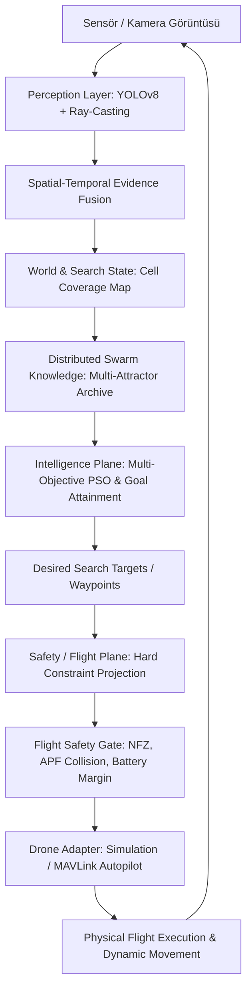
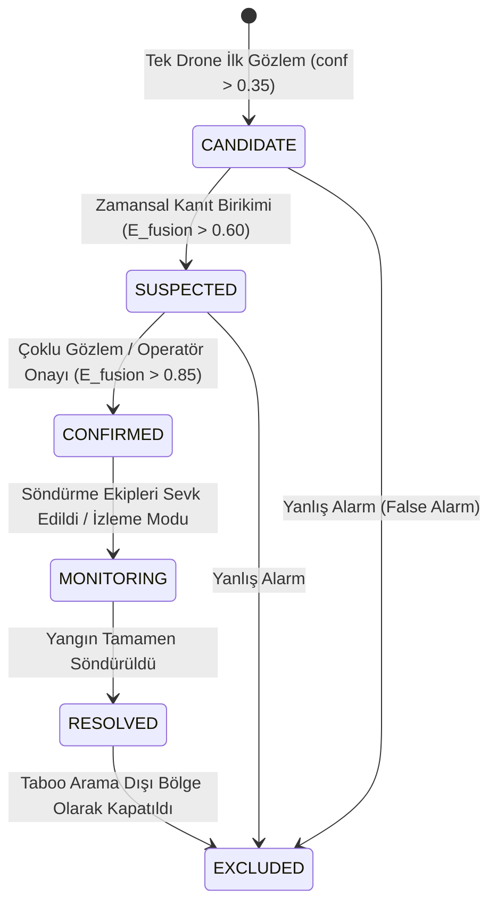

> Tarihsel belge: güncel web kontrol akışı ve doğrulama sınırları için [REAL_WORLD_READINESS](docs/REAL_WORLD_READINESS.md) ve hub kılavuzunu okuyun. Aşağıdaki önceki saha/başarım iddiaları güncel doğrulama sayılmaz.

# PyreSwarm — Sistem Mimarisi ve Tasarım Şartnamesi (System Architecture)
**Platform:** Autonomous Wildfire Detection & Swarm Exploration Platform  
**Sürüm:** 2.5.0-master  
**Tarih:** 2026-09-18  

---

## 1. Sistemin Temel Tasarım Prensibi (Closed-Loop Architecture)

PyreSwarm, körü körüne klasik PSO formülünü fiziksel motorlara bağlayan basit bir script değildir. Sistem, çevresel algılamayı, arama teorisini, güvenlik kısıtlarını ve sürü zekasını birleştiren kapalı çevrimli (closed-loop) bir otonom istihbarat ve uçuş platformudur:



---

## 2. İki Temel Düzlem: Zeka (Intelligence) ve Emniyet (Safety) Ayrımı

Sistemde en kritik mühendislik ilkesi, **Intelligence Plane** ile **Safety Plane**'in birbirinden mutlak olarak ayrılmasıdır. Zeka katmanı motorlara veya otopilot hız kayıtçılarına doğrudan yazamaz; yalnızca "Tavsiye Edilen Hedef Waypoint" ($x_{target}^{des}$) üretir.

```text
+-------------------------------------------------------------------------------+
|                             INTELLIGENCE PLANE                                |
|  - YOLOv8 Algılama & Ray-Casting Zemin Kestirimi                              |
|  - Zamansal & Mekansal Kanıt Birleştirme (Evidence Fusion)                    |
|  - Hücresel Arama & Kapsama Haritası (Search & Coverage Map)                   |
|  - Çok Amaçlı Hedef Ulaşımı (Goal Attainment & MOPSO)                         |
|  - Keşif (Exploration) vs Sömürü (Exploitation) Dengeleme                      |
|  - Çoklu Çekim Merkezleri & Sürü Çeşitliliği (Multi-Attractor Archive)        |
+-------------------------------------------------------------------------------+
                                      │
                         Tavsiye Edilen Hedef Waypoint
                                      ▼
+-------------------------------------------------------------------------------+
|                           SAFETY / FLIGHT PLANE                               |
|  - No-Fly Zone (NFZ) ve Taboo Arama Sınır Denetimi                            |
|  - Sürü İçi Minimum Ayrılma (APF Separation: d_ij >= d_safe = 30m)            |
|  - Batarya Geri Dönüş Marjı (E_remaining > E_target + E_home + E_margin)      |
|  - Maksimum/Minimum İrtifa Tavanı (25m <= Alt <= 120m)                        |
|  - Kinematik Hız & İvme Sınırlayıcı (v_min <= v <= v_max = 14 m/s)            |
|  - İletişim Kopması Fail-Safe Mantığı (Loss of Link Protocol)                 |
+-------------------------------------------------------------------------------+
                                      │
                         Doğrulanmış Emniyetli Komutlar
                                      ▼
+-------------------------------------------------------------------------------+
|                            DRONE EXECUTION LAYER                              |
|  - SimulationDroneAdapter / MAVSDKDroneAdapter (PX4/ArduPilot)                |
+-------------------------------------------------------------------------------+
```

---

## 3. Yerel Koordinat Çerçevesi (Local Metric ENU Frame)

Küresel enlem ve boylam (WGS84) koordinatları üzerinde doğrudan Öklid mesafesi hesaplamak, kutuplara ve enlemlere bağlı olarak ciddi açısal ve metrik bozulmalara yol açar. Bu nedenle PyreSwarm, Operasyon Üssünü merkez orijin $(lat_0, lon_0, alt_0)$ kabul eden **Yerel Metrik ENU (East-North-Up)** teğet düzlem dönüşüm katmanı kullanır:

### WGS84 $\rightarrow$ ENU Dönüşümü:
$$x_{East} = (lon - lon_0) \cdot \frac{\pi}{180} \cdot R_{Earth} \cdot \cos(lat_0)$$
$$y_{North} = (lat - lat_0) \cdot \frac{\pi}{180} \cdot R_{Earth}$$
$$z_{Up} = alt - alt_0$$
Burada $R_{Earth} \approx 6,378,137\text{ metre}$ (WGS84 ekvatoral yarıçapı).

Tüm parçacık hızları ($v_x, v_y, v_z$), çarpışma önleme mesafeleri ($d_{ij}$), rüzgar vektörleri ve batarya enerji maliyetleri yerel ENU metrik uzayında hesaplanır ve otopilota gönderilirken WGS84'e geri dönüştürülür.

---

## 4. Algılama ve Zemin Projeksiyonu Katmanı (Perception Layer)

### 4.1. Detector Adapter Mimarisi
Model framework bağımlılığını en aza indirmek için adaptör yapısı uygulanmıştır:
```text
FireDetector (ABC)
 ├── UltralyticsDetector (PyTorch / CUDA / CPU - Mevcut best.pt)
 ├── MockDetector (Deterministik birim testleri için sentetik algılayıcı)
 └── ONNXDetector / TensorRTDetector (Gelecek yüksek FPS gömülü sistemler)
```

### 4.2. Pinhole Ray-Casting Zemin GPS Projeksiyonu
Kamera matrisi $K$ ve drone'un Euler açıları $(\phi, \theta, \psi)$ ile gimbal açısı kullanılarak alev veya duman pikseli yer yüzeyi düzlemine projekte edilir.

### 4.3. Spatial-Temporal Evidence Fusion
Tek bir frame'deki anlık gürültü yangın alarmı oluşturamaz. $K$ adet ardışık zaman penceresinde:
$$E_{fusion}(t) = \alpha \cdot E_{fusion}(t-1) + (1 - \alpha) \cdot \text{conf}_{detector}(t)$$
Formülüyle kanıt biriktirilir ve çoklu drone'ların aynı bölgedeki teyitleri kümelenir.

---

## 5. Yangın Olayı Yaşam Döngüsü (FireIncident Lifecycle)

Sürüde her tespit bağımsız bir yangın değildir. Mekansal kümeleme (Spatial DBSCAN/Radius Clustering) uygulanarak aynı odağa bakan drone'lar tek bir `FireIncident` altında birleştirilir:



---

## 6. Çok Amaçlı Sürü Optimizasyonu (Goal Attainment & Multi-Attractor MOPSO)

### 6.1. Çok Amaçlı Uygunluk (Multi-Objective Fitness) Fonksiyonu
Klasik PSO'nun körü körüne yalnızca tek bir yangın puanını maksimize etmesi engellenmiş, aşağıdaki normalize bileşenler tanımlanmıştır:

$$J = w_f \hat{F} + w_s \hat{S} + w_c \hat{C} - w_r \hat{R} - w_e \hat{E} - w_o \hat{O} - w_d \hat{D}$$

Burada tüm terimler $[0, 1]$ aralığında normalize edilir:
1. $\hat{F}$: Yangın tespit kanıt skoru (Fire Evidence).
2. $\hat{S}$: Öncül duman kanıt skoru (Smoke Evidence).
3. $\hat{C}$: Yeni hücresel alan keşif değeri (Cell Exploration Value).
4. $\hat{R}$: Risk ve tehlike faktörü (Risk / Proximity to Hazard).
5. $\hat{E}$: Tüketilecek tahmini enerji maliyeti (Energy Cost).
6. $\hat{O}$: Diğer drone'ların kapsama alanıyla gereksiz örtüşme cezası (Coverage Overlap Penalty).
7. $\hat{D}$: Mevcut konumdan hedefe seyahat mesafesi maliyeti (Distance / Transit Cost).

Ağırlık vektörü $\mathbf{w} = [w_f, w_s, w_c, w_r, w_e, w_o, w_d]$ `config/mission_config.json` üzerinden yönetilir.

### 6.2. Çoklu Çekim Merkezleri (Multi-Attractor Archive) & Swarm Diversity
Tüm sürünün tek bir yangına çökmesini (Swarm Collapse) önlemek için:
- Keşfedilen her doğrulanmış veya şüpheli yangın odağı bir **Çekim Merkezi (Attractor)** olarak arşive alınır.
- Bir yangın odağını doğrulamak için filodan en fazla $k_{max}$ (örn. 1 veya 2) drone tahsis edilir.
- Kalan drone'lar arama/keşif alt-sürüsü (Exploration Sub-Swarm) olarak haritanın taranmamış hücrelerine yönlendirilir.

---

## 7. Hücresel Arama Haritası (Cell-Based Search Map)

Arama alanı $M \times N$ metrik grid hücrelerine bölünür (örneğin her hücre $50\text{ m} \times 50\text{ m}$). Her hücre şu öznitelikleri taşır:
- `searched_probability`: $[0.0, 1.0]$ (Sensör ayak izi geçtikçe artar).
- `last_visit_timestamp`: Son üzerinden geçiş zamanı.
- `fire_evidence`: Yangın tespit olasılığı.
- `is_excluded`: No-Fly veya Taboo alanında kalma durumu.
- `priority`: Rüzgar altı yayılma yönüne göre dinamik öncelik skoru.

---

## 8. Dağıtık Haberleşme ve Durum Yönetimi (Distributed Communication)

```text
MessageBus (Soyut İletişim Veri Yolu)
 ├── InMemoryBus (Hızlı deterministik testler ve yerel simülasyon)
 └── WebSocketBus / MQTTBus (Dağıtık yer istasyonu ve fiziksel drone telemetrisi)
```

### Konu (Topic) ve Olay Mimarisi:
- `swarm/{id}/drone/{drone_id}/telemetry` $\rightarrow$ Konum, hız, batarya, irtifa.
- `swarm/{id}/detection` $\rightarrow$ Yeni alev/duman algılama kanıtı.
- `swarm/{id}/incident` $\rightarrow$ Yangın olayı durum güncellemesi.
- `swarm/{id}/mission` $\rightarrow$ Görev başlatma, durdurma, üsse dönüş.

### Bağlantı Kopması Durum Makinesi (Comm Loss Failsafe):
- `CONNECTED`: Heartbeat $< 2.0\text{ sn}$. Normal PSO katılımı.
- `DEGRADED`: $2.0\text{ sn} \le \text{Heartbeat} < 5.0\text{ sn}$. Telemetri gecikmeli, son bilinen yön korunur.
- `STALE`: $5.0\text{ sn} \le \text{Heartbeat} < 10.0\text{ sn}$. Arama havuzundan geçici çıkarılır, çarpışma güvenliği için son konumu tamponlanır.
- `DISCONNECTED`: $\text{Heartbeat} \ge 10.0\text{ sn}$. Otonom eve dönüş (RTL) fail-safe'i tetiklenir.

---

## 9. Kalıcılık ve Güvenlik (Persistence & Security)
- **Veritabanı:** Görev geçmişi, telemetri logları, incident tarihçesi ve metriklerin SQLite üzerinde kalıcı saklanması (`pyreswarm.db`).
- **Kimlik Doğrulama:** Dinamik katılan drone'lar için token tabanlı oturum doğrulama.
- **Audit Trail:** Operatörün bölge kapatma, görev durdurma ve incident teyit işlemlerinin kayıt altına alınması.
