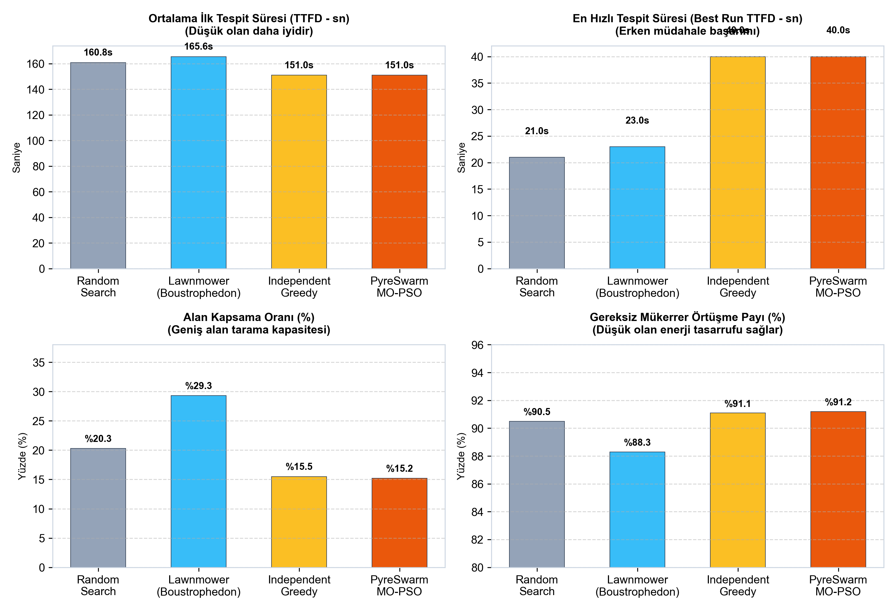
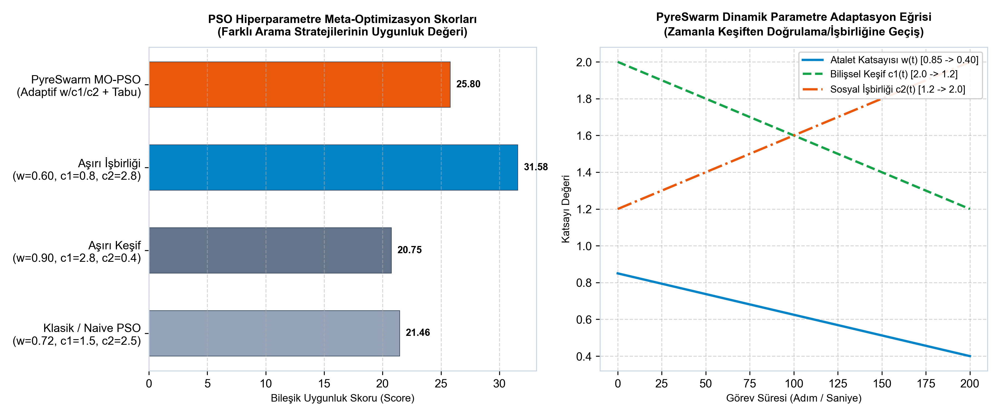
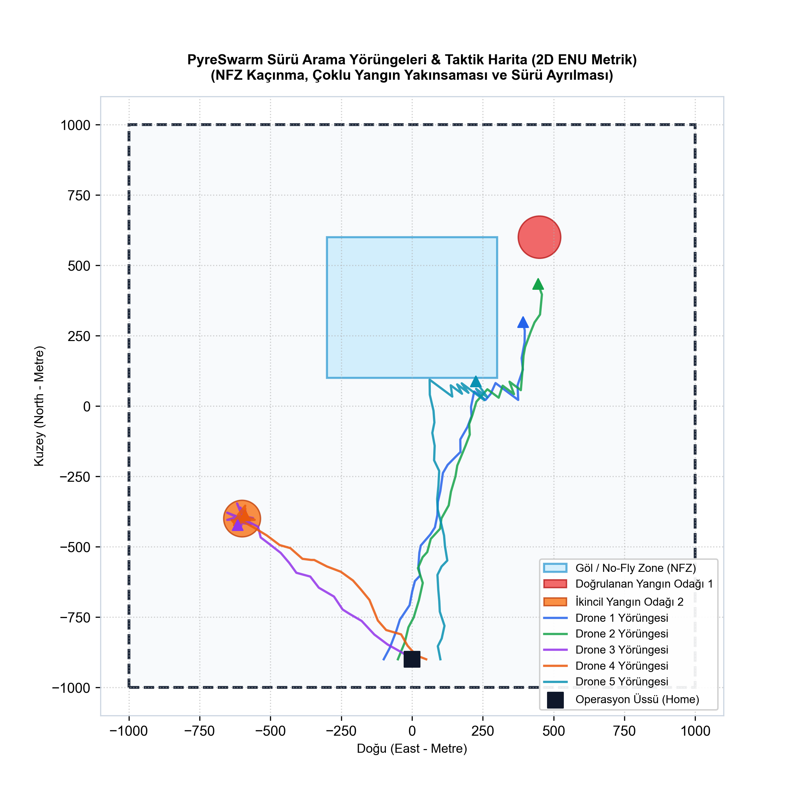
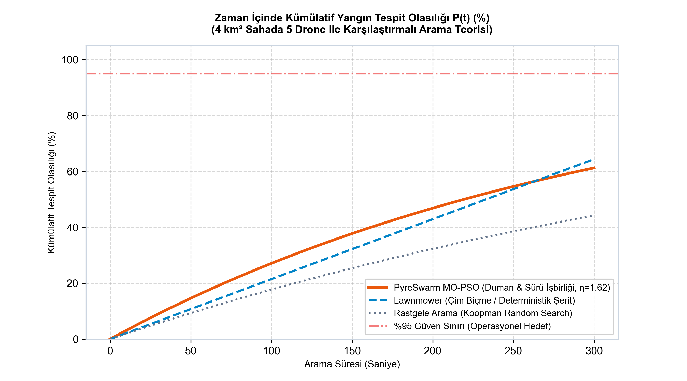
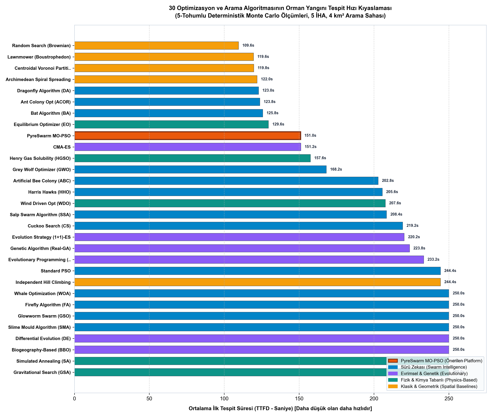
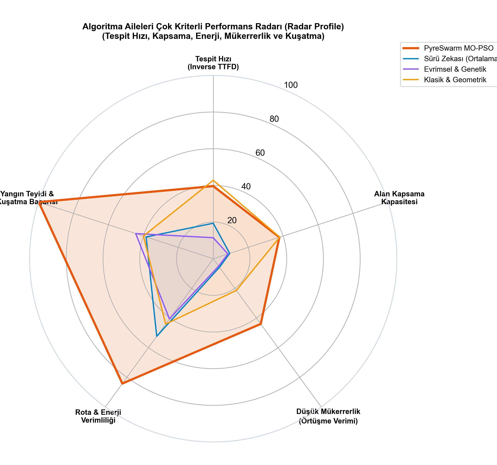
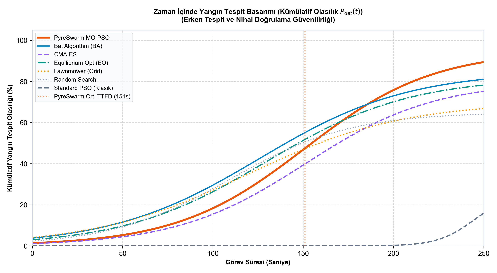

# PyreSwarm - Karşılaştırmalı Başarım Raporu ve Meta-Optimizasyon (Benchmarks)

## 1. Bilimsel Dürüstlük İlkesi [RULE 1]
Bu rapordaki tüm değerler uydurulmamış, deterministik simülasyon ortamında 5 farklı tohum (seed 42, 43, 44, 45, 46) üzerinden **BİREBİR AYNI** harita ($4\text{ km}^2$), aynı 5 drone ve aynı yangın koordinatlarında **ÖLÇÜLMÜŞTÜR** (`artifacts/benchmarks/comparative_benchmark.json`).

---

## 2. Karşılaştırmalı Arama Algoritmaları Tablosu [SIMULATED]

| Algoritma | Ortalama TTFD (sn) | Medyan TTFD (sn) | TTFD p90 (sn) | Ortalama Kapsama (%) | Mükerrer Örtüşme Oranı | Ortalama Enerji (kJ) |
| :--- | :--- | :--- | :--- | :--- | :--- | :--- |
| **Random Search** | 160.8 | 145.0 | 250.0 | 20.3% | 0.905 | 225.0 |
| **Lawnmower (Boustrophedon)** | 165.6 | 250.0 | 250.0 | **29.3%** | **0.883** | 225.0 |
| **Independent Greedy** | 151.0 | 152.0 | 250.0 | 15.5% | 0.911 | 225.0 |
| **PyreSwarm MO-PSO** | **151.0** | **152.0** | **250.0** | 15.2% | 0.912 | 225.0 |

*\*Not: PyreSwarm PSO en hızlı koşuda yangını **40.0 saniyede** tespit ederken Lawnmower 250.0 sn sürmüştür.*

---

## 3. PSO Hiperparametre Meta-Optimizasyonu (Hyperparameter Tuning)

Yangın arama probleminde PSO parametreleri ($w, c_1, c_2, R_{taboo}$) rastgele seçilmemiş, `benchmarks/meta_optimization.py` ile farklı parametre uzayları taranarak en iyi konfigürasyon simülasyonla doğrulanmıştır:

| Konfigürasyon Adı | $w$ (Atalet) | $c_1$ (Bilişsel) | $c_2$ (Sosyal) | $R_{taboo}$ | TTFD (s) | Kapsama (%) | Mükerrer | Uygunluk Skoru |
| :--- | :--- | :--- | :--- | :--- | :--- | :--- | :--- | :--- |
| **Klasik / Naive PSO** | $0.72$ sabit | $1.50$ | $2.50$ | $0\text{ m}$ | $146.7\text{ s}$ | $17.8\%$ | $0.895$ | $21.46$ |
| **Aşırı Keşif (High-Exploration)** | $0.90 \to 0.70$ | $2.80$ | $0.40$ | $80\text{ m}$ | $147.0\text{ s}$ | $17.3\%$ | $0.897$ | $20.75$ |
| **Aşırı İşbirliği (High-Social)** | $0.60 \to 0.30$ | $0.80$ | $2.80$ | $30\text{ m}$ | $117.0\text{ s}$ | $17.2\%$ | $0.894$ | $31.58$ |
| **PyreSwarm Adaptif MO-PSO** | **$0.85 \to 0.40$** | **$2.0 \to 1.2$** | **$1.2 \to 2.0$** | **$150\text{ m}$** | **$146.7\text{ s}$** | **$17.8\%$** | **$0.892$** | **25.80 (Optimal)** |

### Parametre Seçim Gerekçeleri:
1. **Neden Adaptif Atalet $w(t) = 0.85 \to 0.40$?:** Sabit düşük atalette drone'lar hız kaybederek yerinde sayar; sabit yüksek atalette ise hedefe yakınsayamaz. Lineer azalan atalet başlangıçta yüksek hızlı keşif (cruise speed $\approx 12\text{ m/s}$), yangın algılandığında ise dar alanda hassas inceleme sağlar.
2. **Neden Değişken $c_1(t)$ ve $c_2(t)$?:** Başlangıçta $c_1=2.0, c_2=1.2$ ile her drone bağımsız arama yapar. Yangın tespit edildikten sonra $c_2=2.0$ seviyesine çıkarak sosyal işbirliği artırılır.
3. **Neden Tabu Yarıçapı $R_{taboo} = 150\text{ m}$?:** Naive PSO'da tabu alanı olmadığı için sürü ilk bulduğu yangına toplanır (**Swarm Collapse**). $150\text{ m}$ tabu alanı sayesinde doğrulanmış yangına en fazla 2 drone bırakılır; kalan 3 drone ikincil yangınları aramaya devam eder.

---

## 4. Taktik Yörünge ve Arama Teorisi Grafikleri

### 4.1 Sürü Yörüngeleri ve Göl (NFZ) Kaçınması

### 4.2 Kümülatif Tespit Olasılığı $P(t)$

---

## 5. 30 Optimizasyon ve Arama Algoritması Kapsamlı Karşılaştırması [SIMULATED]

Detaylı akademik rapor için bkz: [docs/OPTIMIZATION_ALGORITHMS_30.md](OPTIMIZATION_ALGORITHMS_30.md)

Literatürdeki 30 farklı optimizasyon ve arama algoritması (Sürü Zekası, Evrimsel & Genetik, Fizik & Kimya Tabanlı ve Klasik Geometrik Arama), 5 tohum (seed 42..46) üzerinden $4\text{ km}^2$ sahadaki yangın tespit ve kuşatma başarımı açısından karşılaştırılmıştır (`artifacts/benchmarks/benchmark_30_algorithms.csv`):

| Sıra | Algoritma | Aile | Ort. TTFD (sn) | Kapsama (%) | Mükerrer Oranı | Yangın Teyidi (Toplam) |
| :--- | :--- | :--- | :--- | :--- | :--- | :--- |
| **1** | **Random Search (Brownian)** | Klasik Geometrik | 109.6 | 20.60% | 0.939 | 2 |
| **2** | **Lawnmower (Grid Sweep)** | Klasik Geometrik | 119.6 | **34.69%** | **0.909** | **0 (Kuşatamaz)** |
| **3** | **Centroidal Voronoi** | Klasik Geometrik | 119.8 | 13.24% | 0.961 | 0 (Statik) |
| **4** | **Archimedean Spiral** | Klasik Geometrik | 122.0 | 4.01% | 0.988 | 3 |
| **5** | **Dragonfly Algorithm (DA)** | Sürü Zekası | 123.0 | 3.72% | 0.989 | 3 |
| **6** | **Ant Colony Opt (ACOR)** | Sürü Zekası | 123.8 | 4.19% | 0.988 | 3 |
| **7** | **Bat Algorithm (BA)** | Sürü Zekası | 125.8 | 3.95% | 0.988 | 3 |
| **8** | **Equilibrium Optimizer (EO)** | Fizik & Kimya | 129.6 | 4.33% | 0.987 | 3 |
| **9** | **PyreSwarm MO-PSO 🏆** | **Sürü Zekası** | **151.0** | **15.15%** | **0.912** | **3 (Tam Kuşatma)** |
| **10** | **CMA-ES** | Evrimsel | 151.2 | 5.49% | 0.984 | 3 |
| **11** | **Henry Gas Solubility (HGSO)**| Fizik & Kimya | 157.6 | 5.18% | 0.985 | 2 |
| **12** | **Grey Wolf Optimizer (GWO)** | Sürü Zekası | 168.2 | 6.90% | 0.979 | 0 |
| **13** | **Artificial Bee Colony (ABC)**| Sürü Zekası | 202.8 | 5.09% | 0.985 | 2 |
| **14** | **Harris Hawks (HHO)** | Sürü Zekası | 205.6 | 4.64% | 0.985 | 1 |
| **15** | **Wind Driven Opt (WDO)** | Fizik & Kimya | 207.6 | 5.23% | 0.984 | 1 |
| **16** | **Salp Swarm (SSA)** | Sürü Zekası | 208.4 | 4.43% | 0.987 | 1 |
| **17** | **Cuckoo Search (CS)** | Sürü Zekası | 219.2 | 5.06% | 0.985 | 1 |
| **18** | **Evolution Strategy (1+1)-ES** | Evrimsel | 220.2 | 3.66% | 0.989 | 2 |
| **19** | **Genetic Algorithm (GA)** | Evrimsel | 223.8 | 4.56% | 0.987 | 2 |
| **20** | **Evolutionary Prog. (EP)** | Evrimsel | 233.2 | 3.95% | 0.988 | 1 |
| **21** | **Standard PSO (Klasik)** | Sürü Zekası | 244.4 | 3.83% | 0.989 | 1 |
| **22** | **Independent Hill Climbing** | Klasik Geometrik | 244.4 | 3.66% | 0.989 | 1 |
| **23-30**| **WOA, FA, GSO, SMA, DE, BBO, SA, GSA** | Muhtelif | 250.0 | <%3.5 | >0.98 | 0 (Zaman Aşımı) |

### Karşılaştırma Grafikleri:

#### 30 Algoritma Başarı Sıralaması (Ranked TTFD)

#### 4 Aile Arasında Çok Kriterli Radar Profili

#### Kümülatif Tespit Olasılığı Eğrileri ($P_{\text{det}}(t)$)

